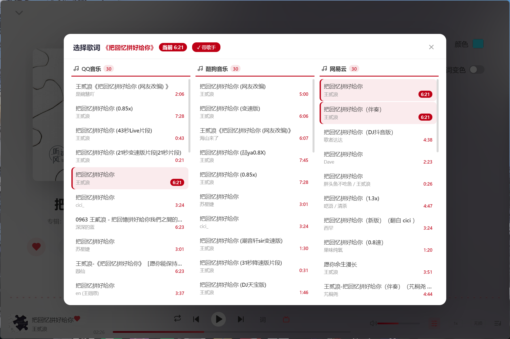
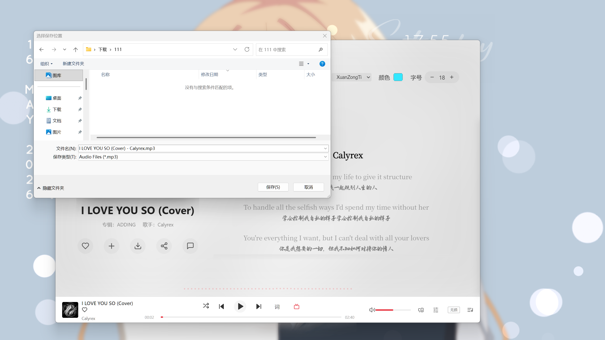
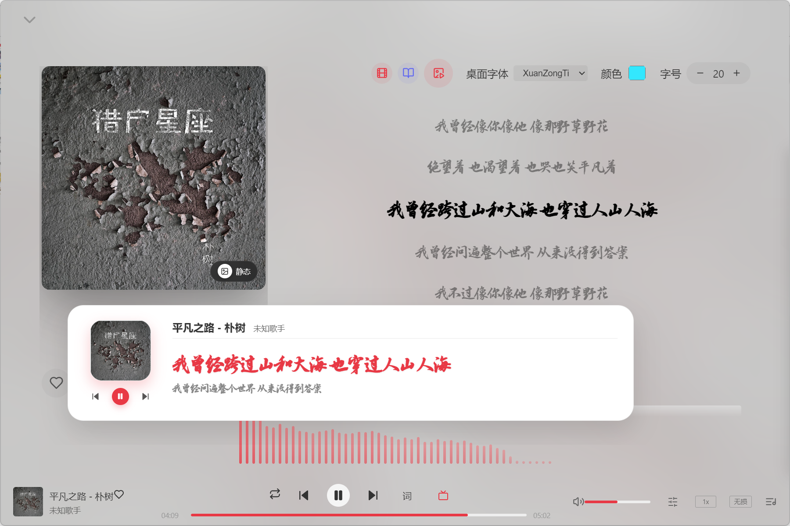

# 🎵 茗韵时光 (MingYun Time) — Music Player

> **本项目完全由 AI (Claude Code) 创作** | [English Version](README_EN.md)

一款精美的桌面音乐播放器，基于 **Vue 3** + **Electron** 构建，集成 **网易云音乐 / 酷狗概念版 / QQ 音乐** 三大平台 API，支持在线音乐播放/搜索/歌单管理，并内置**动漫观看**、**影视播放**、**统一下载中心**与 **B站视频解析**模块（HLS 流播放 + Bangumi 元信息聚合 + DASH 高画质合并）。

---

## ✨ 功能

### 🏠 发现音乐


- 个性推荐、轮播图、歌单、最新音乐、排行榜、热门歌手

### 🔍 搜索


- 搜索歌曲、歌手、专辑、视频、歌单

### 🎧 歌曲详情


- 全屏歌词覆盖层，封面展示、频谱可视化
- 收藏、添加到歌单、下载、分享、评论
- 内置多字体切换，桌面歌词字体/颜色/字号自定义
- 歌词位置上下微调（-200px ~ +200px）
- **逐词/逐行歌词切换**：支持 YRC 逐词高亮与普通逐行高亮两种模式一键切换
- **多歌词源选择**：本地/在线歌曲均支持 QQ音乐、酷狗、网易云三平台歌词搜索，各 30 条结果并列展示




### 📋 歌单管理


- 创建、删除、编辑、收藏歌单
- 添加/移除歌曲，上传自定义封面

### 💻 本地音乐


- 导入文件/文件夹（MP3、FLAC、WAV、OGG、M4A）
- **自动匹配在线封面** → 自动下载保存为 `歌曲名.jpg` 到歌曲同目录
- **自动匹配在线歌词** → 自动保存为 `歌曲名.lrc` 到歌曲同目录
- 元数据编辑（标题、歌手、专辑、年份、风格、封面）
- GIF/静态封面切换
- **下载歌曲自动带封面**，保存到本地目录



- MV 播放：**本地优先 + 线上自动匹配**。歌曲详情页 MV 按钮会优先匹配本地 MV 文件，找不到时自动调用网易云 MV API 按歌名匹配线上 MV


### 🔄 最近播放


- 播放历史记录，支持快速播放

### 🎤 桌面歌词



- 悬浮透明歌词窗口，始终置顶
- **锁定模式**：鼠标穿透到下层应用 + 独立解锁按钮
- 字体、颜色、字号可自定义

### 🎚️ 均衡器


- 8 种预设：默认、流行、古典、摇滚、电子、人声、爵士、低音
- 10 段图示均衡器，增益范围 -12dB ~ +12dB

### 📝 英文歌词解析


- 基于 DeepSeek API 的 AI 语法解析
- 逐词成分标注 · 时态语态 · 句型结构 · 词汇变形详解
- 解析结果自动保存为 `歌曲名.analysis.json` 到歌曲同目录（离线可用）

### 🎬 视频 & MV


- 在线视频浏览、本地视频管理
- MV 播放器，自动匹配本地 MV 文件；歌曲详情页 MV 按钮支持**本地优先 + 线上自动匹配**（本地无 MV 时调用网易云 MV API 按歌名匹配）
- **B站视频解析**：粘贴 `bilibili.com/video/BVxxx` 或 `b23.tv` 短链，自动调用 B站 API（view + playurl）解析直链
- **扫码登录提升画质**：B站二维码扫码登录后，请求 DASH 格式（fnval=16）可解锁 4K / 1080P+ / HDR / 杜比视界；Cookie 持久化 30 天，登录状态栏显示头像 / 昵称 / 大会员
- **DASH 音视频自动合并**：音视频分离流下载时自动用 ffmpeg 流复制合并为有声 mp4（极快）
- **webRequest 注入 Referer**：自动为 B站 CDN（bilivideo.com）和图片 CDN（hdslb.com）注入 Referer，解决 403/防盗链

### 📺 本地视频

本地视频页面分为三个 Tab：

- **本地视频**：导入文件/文件夹，自动扫描元数据（时长、格式、大小）
- **链接/直播流**：添加 MP4/WebM 直链、HLS(m3u8)、FLV 流，直播流自动标记 LIVE
- **网址解析**：粘贴任意影视/视频网页地址（含 B站 URL），自动提取页面中的视频流；支持 mp4/webm/avi/mkv/mov 等 21 种视频格式扩展名，解析结果统一列出供用户选择播放或下载

### 📦 统一下载中心

所有下载任务（音乐 / 影视 / 动漫 / MV / 视频）统一归口到「下载」专区集中管理：

- **128 路并发不限速**：自定义 HTTP Agent（maxSockets: Infinity）+ aria2c 多线程，满带宽下载
- **aria2c + ffmpeg 打包进程序**（resources/），无需外部依赖
- **实时进度**：速度 / 进度 / 详情 / 链接复制，支持取消 / 重试 / 移除 / 状态筛选
- **历史持久化**：下载记录保存到磁盘，重启不丢失
- **自定义下载链接**：粘贴 URL 自动获取文件名
- m3u8 流采用分片并行下载 + ffmpeg concat 合并；B站 DASH 流自动合并音视频

### 🌸 动漫（樱花动漫）

- **三页架构**：主页（轮播图 + 分类导航 + 最新/热门/排行）、推荐页（季度新番 / 评分榜 / 类型筛选 / 收藏）、详情页
- **多源支持**：默认接入樱花动漫，HTML 卡片解析（`.module-poster-item`），封面优先 `data-original`
- **HLS 播放器**：从播放页 `player_aaaa` JSON 提取 m3u8，hls.js 加载，支持多码率分辨率切换
- **Bangumi 元信息聚合**：标题相似度匹配（Levenshtein 编辑距离，<0.5 自动丢弃），叠加评分/简介/标签/角色/Staff/相关推荐
- **播放体验**：60s 缓冲上限、错误自动恢复、多源兜底、下集预加载、播放进度记忆
- **收藏与历史**：本地收藏夹、观看集数记忆、最近观看列表
- **分页搜索**：24 项/页，页码居中导航，去重过滤无封面项
- **下载**：详情页提供下载入口，统一接入下载中心

### 🎞️ 影视（电影/动漫/电视剧）

- **主页**：神马电影网（smdyu.com，标准 maccms 结构），轮播图 + 8 大分类（动作/喜剧/爱情/科幻/悬疑/惊悚/恐怖/剧情）
- **播放**：从播放页 `player_aaaa` JSON 直接提取 m3u8，hls.js 播放
- **多线路解析**：自动识别 `.play-list#playlist_1/2/3...` 多条播放线路
- **搜索**：`/vod-search--------------.html?wd=关键词`，分页去重
- **TLS 兼容**：已淘汰 appys.pro / czys.tv（机房 TLS 握手失败），改用国内可达的神马电影网
- **下载**：详情页提供下载入口，统一接入下载中心

### 🔐 登录


- 手机号、邮箱、二维码登录
- 用户信息同步、歌单同步

### ☁️ 我的云音乐

- 后端 Web 管理页面上传本地歌曲，支持批量上传 + 自动匹配封面/歌词
- 桌面端双击播放云音乐，自动接入播放列表与下一首逻辑
- 云音乐刷新按钮，实时同步后端歌曲

### 🔒 账号密码锁

- 自建后端可为账号开启密码锁
- 开启后访问「我喜欢的音乐」和自定义歌单需验证密码
- 验证状态跨页面保持，退出登录后自动失效

### 🌐 后端管理网页

- 独立部署的网站后台，支持手机号/二维码/邮箱/Cookie 登录
- 云音乐上传、密码锁管理、账号同步

### 🖥️ 系统托盘

- 托盘最小化、托盘控制（上下曲/播放暂停）、快速退出

### 🎨 界面

- 简洁现代设计、响应式侧边栏、流畅动画、毛玻璃效果

---

## 🚀 快速开始

### 环境要求
- **Node.js** ≥ 18
- **npm** ≥ 9

### 安装
```bash
npm install
```

### 开发预览
```bash
npm run dev
```

### 构建发布
```bash
npm run build
```
构建后的安装包在 `release/` 目录下。

---

## ⚙️ 配置说明

### 1. 三平台音乐 API

本项目集成 **网易云音乐**、**酷狗概念版**、**QQ 音乐** 三大平台的 API（登录、播放、搜索、歌单等）。各平台 API 均基于以下开源项目构建，感谢这些项目的作者：

| 平台 | 开源项目 | 项目地址 |
|------|---------|---------|
| 网易云音乐 | NeteaseCloudMusicApiEnhanced | https://github.com/NeteaseCloudMusicApiEnhanced/api-enhanced |
| 酷狗概念版 | KuGouMusicApi | https://github.com/MakcRe/KuGouMusicApi |
| QQ 音乐 | qq-music-api | https://github.com/sansenjian/qq-music-api |

各平台 API 由 Electron 主进程在本地启动子进程（网易云 3100 / 酷狗 3300 / QQ 3200 端口），失败时自动重启或回退在线备用线路，无需手动配置。

如你需要自建 API 服务，可部署上述开源项目后修改 `src/api/index.js`（网易云）或 `src/api/kugou.js`（酷狗）中的服务地址。

### 2. DeepSeek API Key（英文解析）

英文歌词解析功能需要 **DeepSeek API Key**。

获取地址：https://platform.deepseek.com

两种方式：
- 在应用界面的英文解析面板中输入（自动保存到本地）
- 或在 `src/components/EnglishAnalysis.vue` 中设置默认值

---

## 🏗️ 技术栈

| 层级 | 技术 |
|------|------|
| 前端 | Vue 3 (Composition API)、Pinia、Vue Router 5 |
| 桌面 | Electron 22 |
| 构建 | Vite 5、vite-plugin-electron、electron-builder |
| 图标 | Lucide Vue Next |
| 音频 | Web Audio API（均衡器）、HTML5 Audio |
| 元数据 | music-metadata、node-id3 |
| 动漫/影视 | cheerio（HTML 解析）、hls.js（HLS 流播放）、Bangumi API（元信息聚合） |
| 下载引擎 | aria2c（多线程直链）、ffmpeg（m3u8 合并/DASH 合并）、axios 自定义 Agent（128 路并发不限速） |
| B站解析 | B站 API（view/playurl）、二维码扫码登录、DASH 格式高画质、webRequest Referer 注入 |

---

## 📁 项目结构

```
music/
├── electron/            # Electron 主进程
│   ├── main.js          # 窗口管理、IPC 处理、B站解析/登录、协议注册
│   ├── qq-music.js      # QQ 音乐 API 子进程（3200 端口）
│   ├── kugou-music.js   # 酷狗概念版 API 子进程（3300 端口）
│   ├── netease-api.js   # 网易云 API 子进程（3100 端口）
│   ├── lyric-providers.js  # 多平台歌词搜索（QQ/酷狗）
│   ├── anime.js         # 动漫模块 IPC（樱花动漫解析）
│   ├── anime-meta.js    # Bangumi 元信息聚合 + 标题相似度匹配
│   ├── movie.js         # 影视模块 IPC（神马电影网解析）
│   └── download-manager.js  # 统一下载管理器（aria2c + ffmpeg + 128 并发）
├── resources/           # 打包的 aria2c.exe + ffmpeg.exe + 三平台 API
├── scripts/             # 构建辅助脚本（ensure API 资源）
├── src/
│   ├── api/index.js     # API 客户端 (axios)
│   ├── api/kugou.js     # 酷狗概念版 API 封装
│   ├── api/qq.js        # QQ 音乐 API 封装
│   ├── store/           # Pinia 状态管理 (player、user、message、qq-user、kugou-user)
│   ├── router/          # Vue Router 路由
│   ├── views/           # 页面组件
│   │   ├── Discovery.vue      # 发现音乐（网易云）
│   │   ├── Search.vue         # 搜索（网易云）
│   │   ├── SongDetail.vue     # 歌曲详情/全屏歌词
│   │   ├── PlaylistDetail.vue # 歌单详情管理
│   │   ├── AlbumDetail.vue    # 专辑详情
│   │   ├── LocalMusic.vue     # 本地音乐管理
│   │   ├── LocalVideo.vue     # 本地视频管理
│   │   ├── RecentPlay.vue     # 最近播放
│   │   ├── Video.vue          # 在线视频
│   │   ├── Anime.vue          # 动漫主页（樱花动漫）
│   │   ├── AnimeRecommend.vue # 动漫推荐页（季度新番/评分/分类/收藏）
│   │   ├── AnimeDetail.vue    # 动漫详情页（HLS 播放器 + Bangumi 元信息）
│   │   ├── Movie.vue          # 影视主页（神马电影网）
│   │   ├── MovieDetail.vue    # 影视详情页（多线路播放）
│   │   ├── Downloads.vue      # 统一下载中心
│   │   ├── DesktopLyrics.vue  # 桌面歌词窗口
│   │   ├── qq/               # QQ 音乐平台视图（发现/搜索/歌单/专辑/歌手/我喜欢）
│   │   └── kugou/            # 酷狗概念版平台视图（发现/搜索/歌单/专辑/歌手/我喜欢）
│   ├── components/      # 共享组件
│   │   ├── EnglishAnalysis.vue  # AI 英文歌词解析
│   │   ├── EqPanel.vue          # 均衡器面板
│   │   ├── LoginModal.vue       # 登录弹窗（三平台登录）
│   │   ├── KugouComment.vue     # 酷狗歌曲评论
│   │   ├── MvPlayer.vue         # MV 播放器
│   │   └── Toast.vue            # 通知提示
│   ├── style.css        # 全局样式 + CSS 变量（三平台主题）
│   ├── App.vue          # 根组件（布局外壳）
│   └── main.js          # 应用入口
├── showimage/           # README 截图
├── font/                # 桌面歌词自定义字体
├── build/               # 构建资源（图标）
├── package.json
└── README.md
```

---

## 📦 下载

前往 [Releases](https://github.com/xiaomingky/MingYunTime/releases) 页面下载最新安装包。

---

## ☕ 赞赏
[](https://dartnode.com "Powered by DartNode - Free VPS for Open Source")
如果觉得好用，欢迎请开发者喝杯咖啡！


---

## 📄 协议

MIT

---

## 👤 联系

- 网站：[xiaomingky.cn](https://xiaomingky.cn)
- 问题反馈：[GitHub Issues](https://github.com/xiaomingky/MingYunTime/issues)
