# MingYun Time · 茗韵时光

**Three music platforms, two lyric styles, videos and esports in a Windows desktop player.**

[中文版](README.md) · [Download v3.6.1](https://github.com/xiaomingky/MingYunTime/releases/tag/v3.6.1) · [Report an issue](https://github.com/xiaomingky/MingYunTime/issues) · [GitHub Star](https://github.com/xiaomingky/MingYunTime)

[App website](https://music.xiaomingky.dpdns.org) · [Author website](https://xiaomingky.dpdns.org)

   

Built with Vue 3 and Electron 22, MingYun Time integrates NetEase Cloud Music, QQ Music and KuGou Concept Edition. Discover music, search, open playlists and albums, arrange a playback queue, manage local music, switch between Classic and Apple Music-style lyrics, use desktop lyrics and EQ, and manage downloads in one place. The video area includes Bilibili, anime, movies, URL parsing and streams; the entertainment area covers CS / VAL esports; digital textbooks provide reading, annotation and companion audio.

> This project is developed with AI assistance. This English README is a translation of the guide; it does not imply an English client interface. Screenshots and GIFs show the current v3.6.1 interface. Online recommendations, charts and esports information change with their sources. Lyric GIFs demonstrate interface animation without audio. The local music screenshot uses sample file entries.

## Contents

- [Download and installation](#download-and-installation)
- [Playback improvements in v3.6.1](#playback-improvements-in-v361)
- [Music platforms and login](#music-platforms-and-login)
- [Search, playlists and albums](#search-playlists-and-albums)
- [Player controls and playback queue](#player-controls-and-playback-queue)
- [Classic and Apple Music-style lyrics](#classic-and-apple-music-style-lyrics)
- [Desktop lyrics and audio effects](#desktop-lyrics-and-audio-effects)
- [Local music, format conversion and lyric retrieval](#local-music-format-conversion-and-lyric-retrieval)
- [NetEase cloud drive and recent plays](#netease-cloud-drive-and-recent-plays)
- [Video area](#video-area)
- [Entertainment and Star favorites](#entertainment-and-star-favorites)
- [Digital textbooks](#digital-textbooks)
- [Download center](#download-center)
- [Settings and smaller conveniences](#settings-and-smaller-conveniences)
- [Keyboard shortcuts](#keyboard-shortcuts)
- [Troubleshooting](#troubleshooting)
- [Development and build](#development-and-build)
- [Credits and support](#credits-and-support)

## Download and installation

1. Open the [v3.6.1 release](https://github.com/xiaomingky/MingYunTime/releases/tag/v3.6.1). Under **Assets**, choose the Windows installer `.exe`, or download the `.7z` archive for portable use, extract it completely and launch the application.
2. The installer uses a native **NSIS wizard**, with a selectable destination and desktop / Start menu shortcuts.
3. After launch, choose a platform at the top left and sign in if needed. Regular use does not require Node.js: music API services and download utilities are included.
4. Local API services take a little time to start. If the first page is empty, wait briefly and refresh.

**System: Windows 7 / 10 / 11, 64-bit.** The project retains Electron 22 and Windows 7 rendering compatibility handling. On older computers, enable performance mode and 30 FPS for Apple Music-style lyrics, and turn off unnecessary spectrum and cover motion. System media overlays, HEVC decoding and similar capabilities still depend on the Windows version, drivers and codecs.

Online playback, downloads, audio quality and account operations depend on the platform's authorization, membership, regional restrictions and resource availability.

## Playback improvements in v3.6.1

| Improvement | What it means when listening |
| --- | --- |
| Redesigned queue drawer | Separate played / now playing / up next sections; drag handles to reorder |
| Playlist and album queue actions | Distinct play now, play next and append-to-queue actions |
| Consistent song menus | Song-row `…` menus offer the same three playback actions |
| Playback mode fixes | List loop, single-track loop and a shuffle pool; shuffle Previous follows actual history |
| Duration fixes | Handles seconds / milliseconds from platform, local and cloud-drive track metadata |

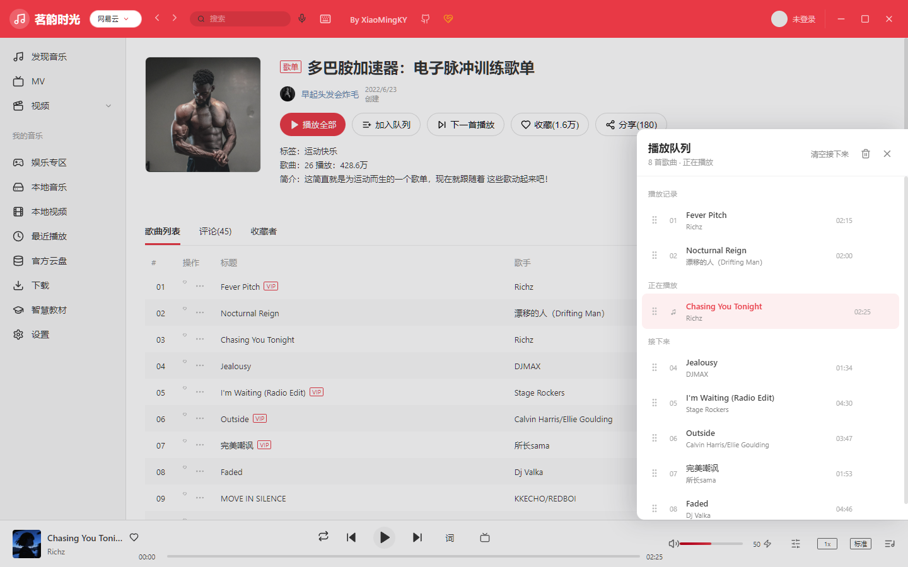

## Music platforms and login

### NetEase Cloud Music

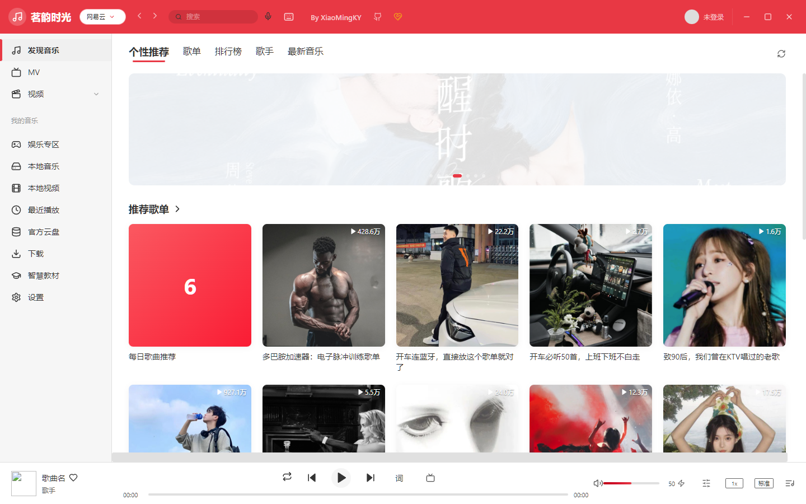

- Choose NetEase Cloud Music at the top left and open Discover Music. The tabs provide personalized recommendations, playlists, charts, artists and new music.
- Click a playlist cover to open its details. New-music song rows can be played directly or arranged through the more menu.
- Click the signed-out account button at the top right for QR code, phone, NetEase email or Cookie login. Confirm a QR login on your phone; refresh expired codes.
- After login, open liked songs, personal playlists and the official cloud drive, and use hearts and supported management actions.
- The current daily-song recommendation card does not yet provide a complete playback entry. Start listening through playlists, search or new music.

### QQ Music

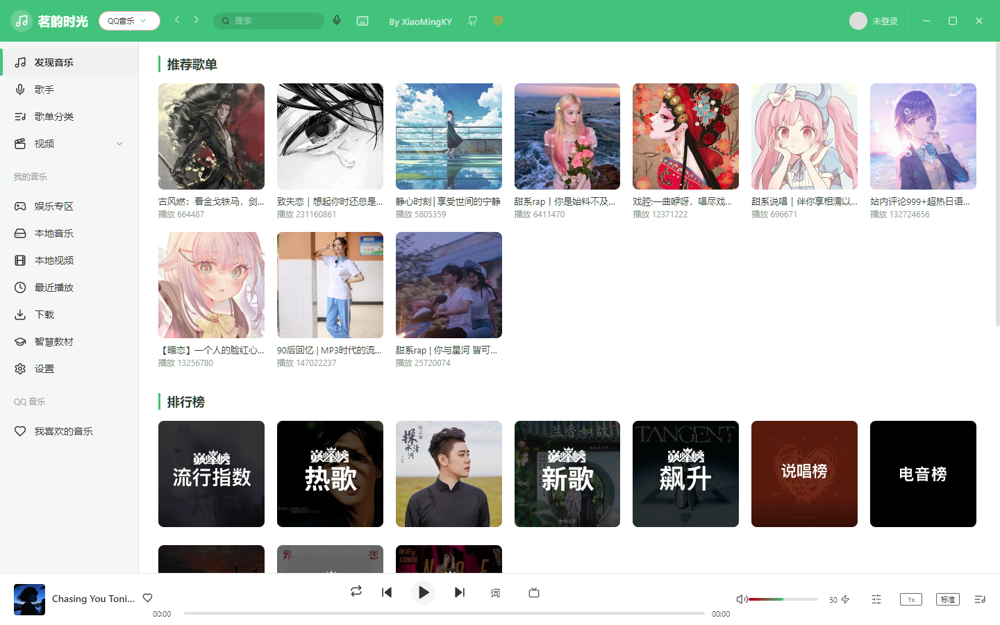

- Select QQ Music at the top left. Browse recommended playlists, charts and new albums; use the sidebar for artists, playlist categories and liked songs.
- Open a playlist, album or artist to view songs, then play or arrange them in the queue.
- The login dialog opens the official QQ Music login window. Follow its instructions to scan with the QQ app. You can also paste a Cookie containing `qm_keyst`.
- Sign in before playback where possible. Playback URLs depend on login, and VIP or restricted tracks require the corresponding permissions.
- QQ playlist editing differs from NetEase and KuGou. Account management is not identical across the three services.

### KuGou Concept Edition

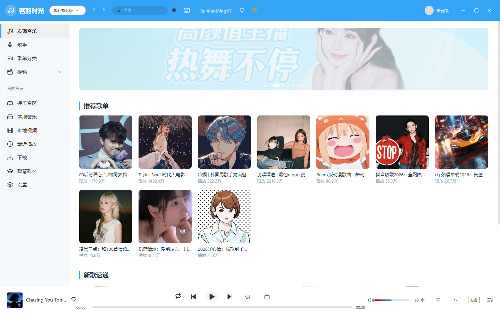

- Select KuGou Concept Edition to browse banners, new songs, new albums and recommended playlists. Artists and playlist categories are available in the sidebar.
- Login supports Concept Edition app QR codes, SMS codes, username and Token / Cookie. Prefer QR or phone login when additional verification is required.
- Once signed in, view created and favorited playlists. Use the available controls to create, expand / collapse and manage them in batches.
- Settings → Account information shows available VIP expiry and claim records, with entries for one-day VIP, three-hour VIP and listening upgrades. Success depends on the platform's response for your account.

**Switching platforms refreshes the interface.** Login state, search history and quality options are stored separately. Choose songs from the destination platform after switching; access permissions remain independent.

## Search, playlists and albums

### Search

Enter a song, artist, album or playlist in the top search box and press Enter. Search uses the selected platform. Switch result tabs for the available content types, choose input suggestions if useful, and revisit search history saved separately for each platform.

### Artists, charts, categories and liked songs

- **Artists**: open the artist tab in Discover or the QQ / KuGou sidebar entry. Use available region, gender and genre filters. Click an avatar for artist details, play popular songs and open albums. QQ also provides available MVs and similar artists; KuGou can load more songs.
- **Charts**: choose Charts in Discover, then open a chart to see its tracks. Use song-row actions for individual tracks and the detail page's play / queue buttons for the whole chart.
- **Playlist categories**: choose tags in the home playlist tab or QQ / KuGou category page, browse covers, paginate or load more where offered, then open a playlist.
- **Liked songs**: sign in to the current platform and open liked songs from the sidebar. Click tracks or use the more menu to arrange them. The bottom heart manages the current song's like state independently of esports Stars.

### Playlists and albums

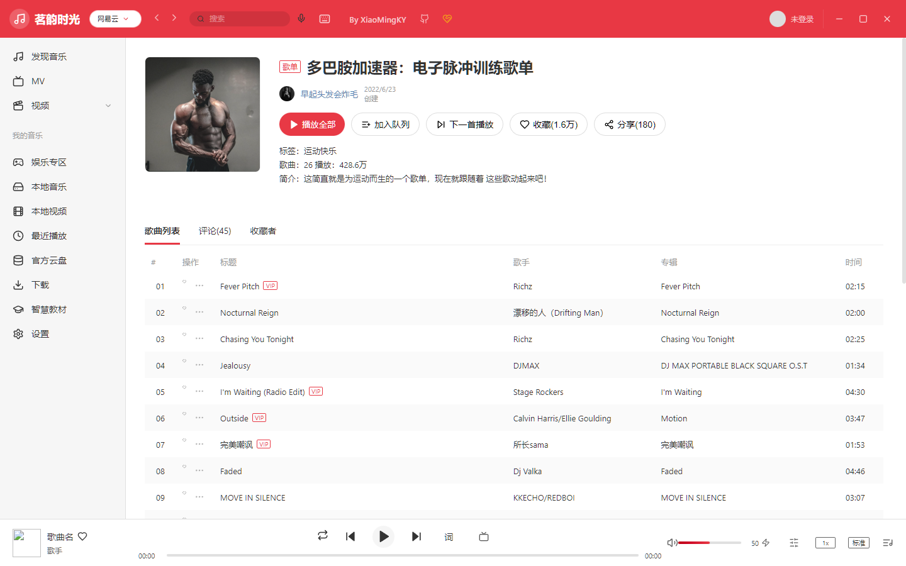

| Button | Behavior | When to use it |
| --- | --- | --- |
| Play all | Builds a queue from this list and starts playback | Listen through a playlist or album |
| Add to queue | Appends the entire list to the queue | Keep the current song playing and listen later |
| Play next | Places the list immediately after the current song | Start this list with the next track |
| Favorite / unfavorite | Changes the platform playlist subscription; usually needs login | Save a playlist for later |
| Share | Uses the share action supported by that page | Share platform content |

For your own playlists, use supported edit, delete, remove-song and cover-change controls. NetEase and KuGou song details offer an add-to-playlist selector; QQ song details currently do not offer the same entry. Comments and subscriber tabs depend on the page and API support.

### The song-row `…` menu

- **Play now**: starts the selected song using its containing list as playback context.
- **Play next**: inserts the song after the current track without interrupting it.
- **Add to playback queue**: appends the song to the end without interrupting playback.

Click outside the menu or press Esc to close it. Hearts, downloads and metadata editing are provided separately where supported. This menu handles these three playback arrangements.

## Player controls and playback queue

### Player controls

| Position / icon | How to use it |
| --- | --- |
| Cover and song title on the left | Open / close song details; hover to see the full title |
| Heart | Like / unlike the current track; online actions usually need login |
| Loop / single / shuffle icon | Click to change mode; hover to see the mode name |
| Previous, play / pause, next | Control playback within the current queue |
| Progress bar | Click or drag to seek |
| Lyric character 「词」 | Open / close lyrics |
| Television icon | Toggle desktop lyrics |
| Volume slider | Drag or use the mouse wheel |
| Lightning icon | Increase gain by 50% per step, up to 500%; high gain can distort audio |
| Equalizer icon | Open the 10-band EQ |
| `1x` | Select 0.5 / 0.75 / 1 / 1.25 / 1.5 / 2x playback |
| Audio quality label | Choose a platform quality; unavailable resources can fall back |
| List icon at the far right | Open / close the queue drawer |

### Arrange the queue

1. Open the drawer and find your position in the played / now playing / up next sections.
2. Hold a song's dotted **drag handle** and drag it. An insertion line shows where it will land.
3. Hover a row and use Play next for a quick move. Use `×` to remove a non-current track.
4. Clear up next removes subsequent entries only. The trash button clears the entire queue after confirmation and stops playback.
5. Click a row to play that entry. Click outside the drawer or use its close button to dismiss it.

Repeated copies of a song can be sorted and removed independently. Reordering the queue does not edit the original online playlist. The queue, current song, index and playback mode are saved; restarting the app does not automatically produce sound.

Shuffle uses a selection pool, with Previous returning through actual listening history. If the current track has played for more than three seconds, Previous first restarts it. Single-track loop repeats on natural completion, and the current Next button also restarts that track in this mode. To choose another song, click its queue entry or use Play now in its song-row menu.

## Classic and Apple Music-style lyrics

Click the bottom cover or lyric button to open details, then choose Classic / Apple Music under Page style in lyric settings. Your choice is saved.

### Classic style

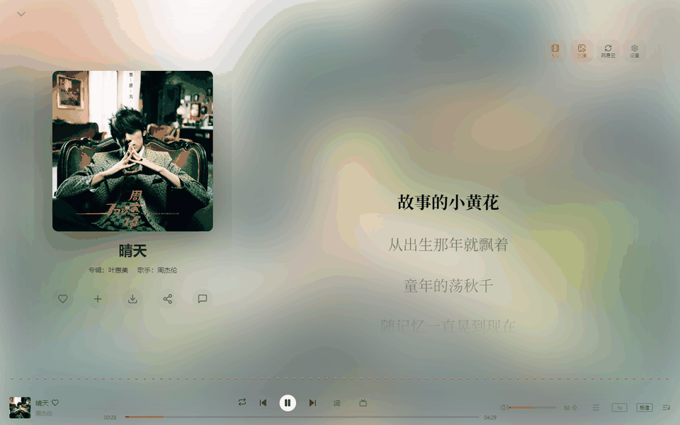

- Cover art and song actions appear on the left, with synchronized lyrics on the right. Click a lyric line to seek to it.
- The immersive / classic switch changes the background within the Classic page; it is separate from the overall page-style choice.
- Switch between word and line timing when word data is available. Otherwise, ordinary line-synchronized lyrics are shown.
- Adjust fonts, sizes, lyric positioning and cover presentation through the available settings.
- Open Lyric source to search NetEase / QQ / KuGou candidates. Choose the correct studio, live or cover version; translation and word timing are not available for every candidate.
- The MV button selects a local or online match. Hearts, add-to-playlist, download, share and comments appear according to the platform.
- For English lyrics, open AI English analysis, select DeepSeek or MiMo v2.5 and enter the corresponding API key. Expand sentences to inspect grammar, tense, voice, vocabulary and word forms. Cached results can be opened again.

### Apple Music style

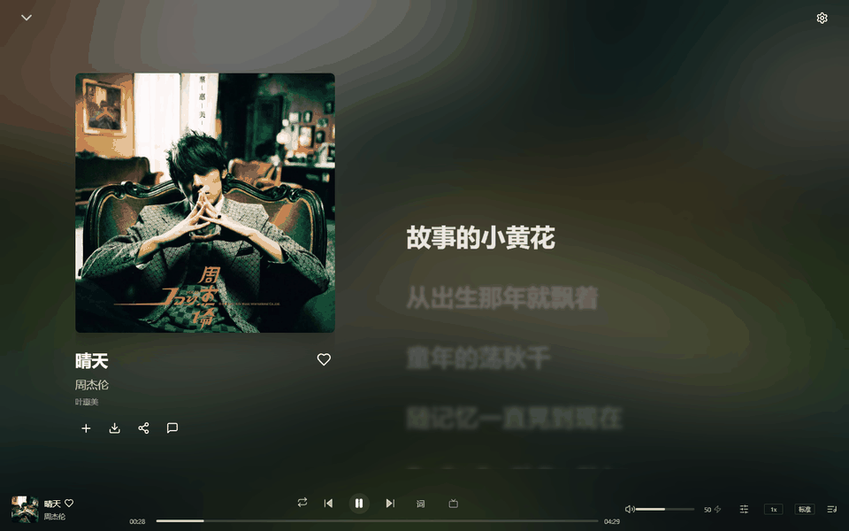

A cover-and-lyrics layout provides following scroll, word highlighting, elastic animation and blur for distant lines. Open the gear at the top right:

| Setting | How to use it |
| --- | --- |
| Page style | Return to Classic or keep Apple Music |
| Cover style / disc rotation | Album cover, CD, vinyl or sleeve; enable / disable cover motion |
| Lyric mode | Word timing when available, otherwise line timing |
| Performance mode / frame rate | 45 FPS for balance or 30 FPS to reduce resource use |
| Update nearby lyrics only | Reduce the rendering cost of long lyrics |
| Audio visualization | Toggle the spectrum; requires actual audio playback |
| Lyric source / MV | Choose another lyric match or local / online MV |
| Translation / translation size | Display available translations, sized 12–30 px |
| Line spacing / lyric size | Spacing 0–24 px; main text 24–64 px |
| Font / distant-line blur | System sans-serif / serif; toggle blur for non-current lines |

After scrolling manually, click Return to current line or wait for automatic following to resume. Click a line to seek. Changing style does not create missing lyric data.

### Character and word-timed lyrics

These captures use the genuine word-timing data for Jay Chou's “一路向北” (All the Way North). They show highlighting moving through each character and advancing to subsequent characters in both page styles. GIFs loop silently.

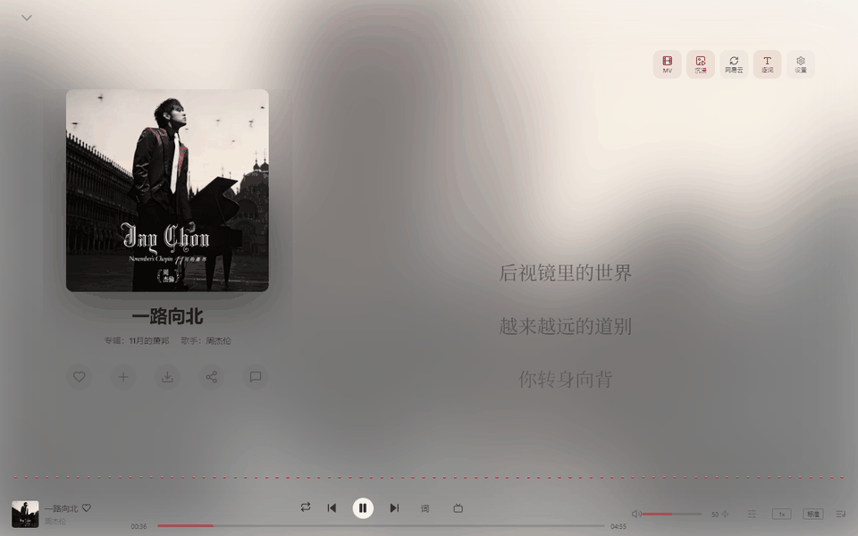


Play a song and open its details. On the Classic page, use the Word / Line button; on the Apple Music page, open the top-right gear and select Lyric mode → Word. The Chinese interface labels this mode “逐词”: Chinese highlighting follows the source's character / word timestamps, while English follows timed words. If timing data is absent, choose a word-timed candidate under Lyric source or use line timing.

## Desktop lyrics and audio effects

- Use the bottom television icon to open always-on-top desktop lyrics. Drag the window while unlocked.
- The lock icon enables click-through; the retained unlock button restores interaction. The close button hides the window.
- Lyric-related settings provide font, color, size, opacity and detailed (cover and controls) / simple (lyrics) modes. Desktop lyrics start disabled on each application launch.
- EQ offers Default, Pop, Classical, Rock, Electronic, Vocal, Jazz and Bass presets. Ten bands span 32 Hz–16 kHz, with gain from `-12 dB` to `+12 dB`.
- Opening EQ for the first time enables it. Closing its panel does not disable processing; use the panel's switch.
- System media sessions support media keys and available system controls. Compatible third-party taskbar media bars can read song title, artist, cover and playback state; presentation varies by Windows version.

## Local music, format conversion and lyric retrieval

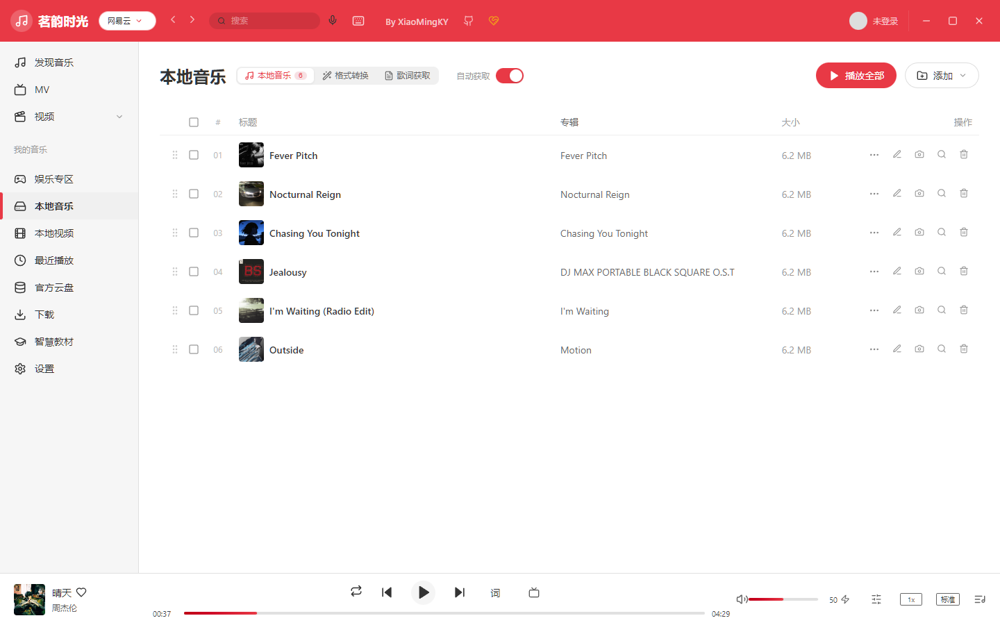

### Local music

1. Choose Add → Add files / Add folder, then wait for scanning.
2. Click a song or Play all. Use dotted handles to rearrange the local list.
3. Checkboxes support batch removal. Removing a list entry is not equivalent to deleting a disk file; follow the confirmation text.
4. The pencil edits title, artist, album, year, genre and cover metadata. The camera searches covers; the search action finds and saves lyrics; `…` arranges playback.
5. Automatic retrieval matches available covers / lyrics and can save images and `.lrc` files beside the song. Select another version manually if a match is wrong.

Common MP3, FLAC, WAV, OGG and M4A files can be imported; actual playback depends on their encoding.

### Format conversion

Open the Format conversion tab, add local files, inspect their detected information, select entries and start. Listed formats include NetEase `ncm`, QQ `qmc` / `mflac` / `mgg`, and KuGou `kgm` / `kgma` / `vpr`. The tool attempts to recover the original format; it does not improve quality through re-encoding. New formats or files missing required information may be unsupported. Check each result and output path.

### Lyric retrieval

Open Lyric retrieval, enter title and artist, and search all platforms or a specific one. Preview candidates, choose parsed / original text, line / word timing, translation and naming order, then select a folder and save `.lrc`. A search result does not guarantee translation or word timing.

## NetEase cloud drive and recent plays

- **Official cloud drive** appears for NetEase only. Sign in and refresh its songs. Upload multiple files, review title, artist, album, cover and lyrics before confirming, and inspect progress and matching results.
- **Recent plays** helps find previously heard songs. Replay a row or use its more menu; this history is not an online playlist.
- The project retains cloud-music and account-password-lock interfaces for a self-hosted backend. These need a separate deployment and configuration; they are not a default public cloud service. Protected playlists require verification when the lock is enabled.

## Video area

Expand Video in the sidebar for anime, movies and Bilibili. Local video handles files, stream links and webpage parsing. Video playback coordinates music state to avoid simultaneous audio.

### Bilibili

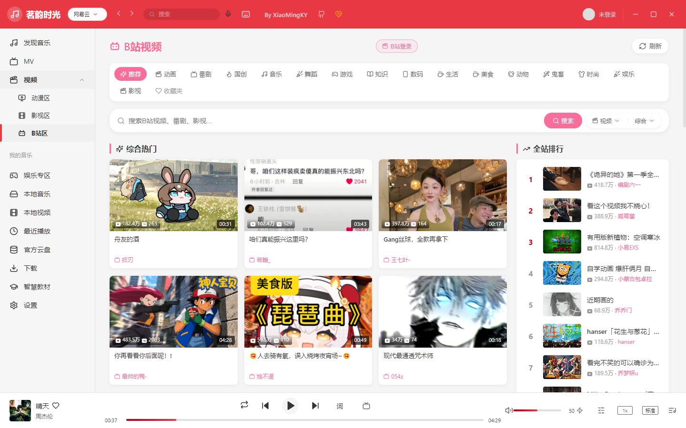

1. Browse recommendations, animation, music, gaming, knowledge and other categories, or search by keyword.
2. Choose available result types such as videos, bangumi, movies or live streams, then select ordering and pagination.
3. Open a card, choose a part / episode, quality, playback speed, volume and danmaku. Enable automatic continuation if needed; playback position is remembered for the same video.
4. Click the creator or a comment avatar to open the creator page and browse uploads / collections. Expand descriptions and replies. Comment images open in a lightbox with zoom, pan and original-image download.
5. Login distinguishes Web and TV. Web Cookie is used for Web permissions and favorites, while TV Token is used for the TV interface. They are not interchangeable; account and content restrictions determine quality.
6. After login, browse Favorites. Start a download and follow it in the download center.

### Anime and movies

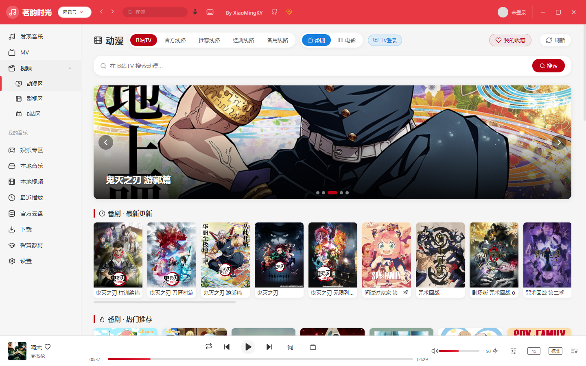

- Anime defaults to Bilibili TV, with bangumi / movie choices and other available routes. Select a source, browse or search, then open a title.
- Choose a route and episode. Where available, details show Bangumi scores, summaries, tags, characters and staff. Favorites, history and progress help resume viewing.
- In Movies, choose a source, category or search term, then select a route / episode in details and use the download entry. External services determine third-party content and availability.
- Refresh or switch routes after loading failures. High quality, member content and downloads are not available for every title.

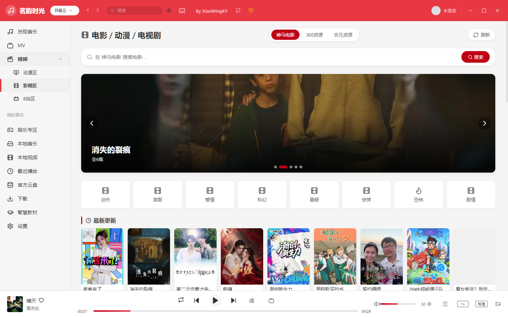

### Local videos, streams and URL parsing

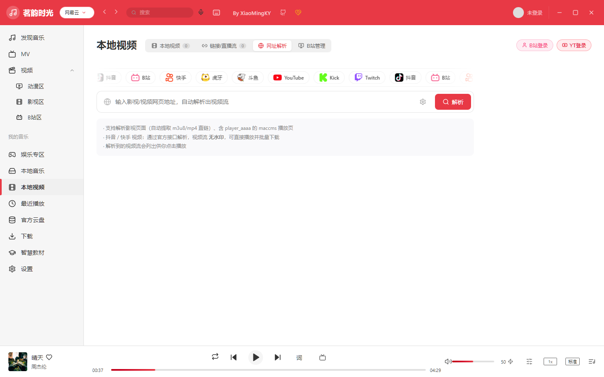

| Tab | How to use it |
| --- | --- |
| Local video | Add files / folders, scan metadata, click a card to play, paginate or remove entries in batches |
| Links / live streams | Add a name and URL; select Auto / MP4 / WebM / HLS / FLV / live; save, play, edit or remove |
| URL parsing | Paste a webpage, parse it, then choose a result to play / download; image posts support preview and batch download |
| Bilibili broadcasting | After login, supply the room / category information requested by the page; starting / stopping broadcasts requires account permissions |

Supported sources include Bilibili, YouTube, Douyin, Kuaishou, Douyu, Huya, Twitch, Kick and supported movie pages. See Settings → Supported parsing platforms for the full list. Site changes and protected content may prevent parsing.

Use the parsing gear to choose the Bilibili Web / TV interface, with its corresponding login above. YouTube uses a separate login window. DASH downloads can merge video and audio; HLS downloads can merge segments. Live-stream downloads behave differently from on-demand videos.

## Entertainment and Star favorites

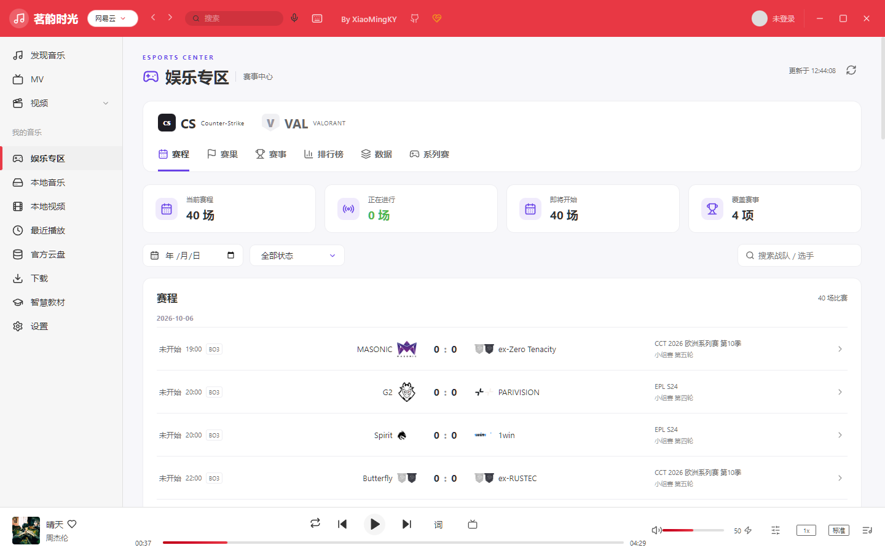

Open Entertainment in the sidebar, then choose **CS / VAL** for Counter-Strike / VALORANT.

| Page | How to use it |
| --- | --- |
| Schedule | Filter by date / status, search teams / players, click a match for details |
| Results | Filter completed matches by date and inspect scores / statistics |
| Events | Filter by status / name, and switch All / Featured / My favorites |
| Rankings | Switch teams / players; CS teams offer VRS / HLTV and VRS regions; VAL uses available region / event filters |
| Data | Choose event, team / player and metrics; All metrics expands columns |
| Series | Choose league, region and season, inspect standings / teams and open details |

### Star and following

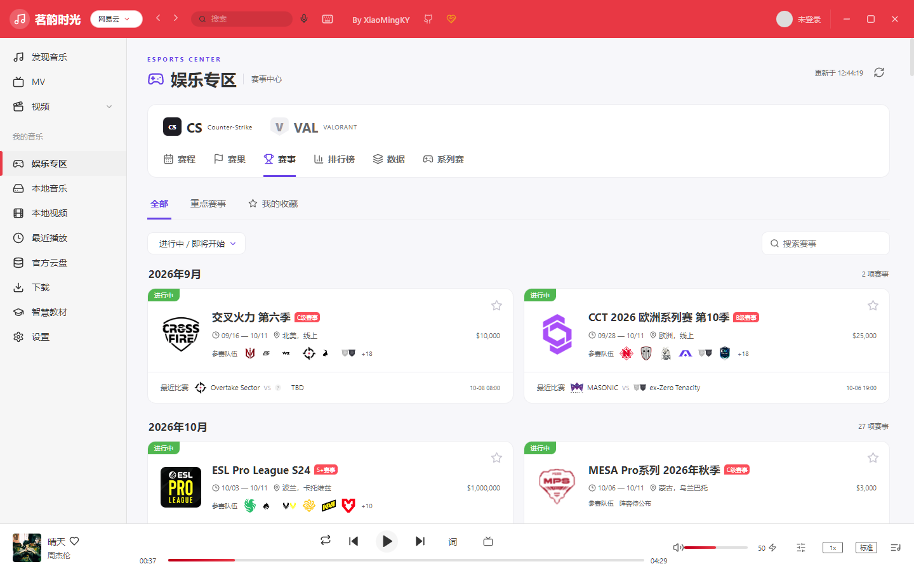

- **Event-card Star**: click the star at the top right to favorite / unfavorite an event. Find it under Events → My favorites. Favorites are saved on this device.
- **Follow a match**: click the star around the match-detail score section to save its follow state locally. This does not subscribe you to system notifications.
- **GitHub Star**: use the app's top GitHub icon to open the repository, sign in to GitHub and click Star at the top right to bookmark and support the project. It does not change in-app favorites.
- **Song heart**: likes a song on the current music platform. It is independent of the three Star actions above.

### Match and event details

- Analysis: inspect recent form, player comparisons and map data. Select players to compare, and switch map views between win rate / PICK / BAN.
- Match statistics: switch overall / individual map and side filters.
- VRS / pre-match predictions: view available results and their sources as esports reference information.
- Live feed: filter maps / event types, load history and toggle automatic refresh.
- Live / replay: select a source and play, or open its original site. Stop playback to release the player. Matches without sources cannot be played.
- Event details: browse schedule / bracket, stages and groups, statistics, participating teams, placements / prizes and map pool. Unpublished information appears as an empty state.

## Digital textbooks

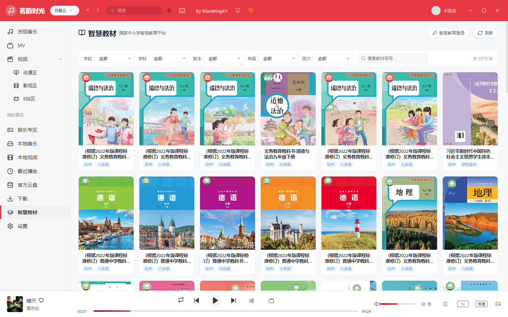

1. Filter by school stage, subject, edition, grade and volume, or search a title.
2. Open a cover to enter the reader. Use arrows to turn pages, or click the page number for a numeric jump keypad.
3. The toolbar provides pan, magnifier, pen, eraser, clear current-page notes, zoom, reset and fullscreen.
4. Drag its blank area / handle to move the toolbar and double-click to reset its position. Annotations belong to the reading view, not cloud-synchronized notes.
5. Play / pause companion audio on the right, and download individual audio items where available.
6. PDF / protected resources require Smart Education login, or you can paste and test your own token. Download tasks appear in the document category.

## Download center

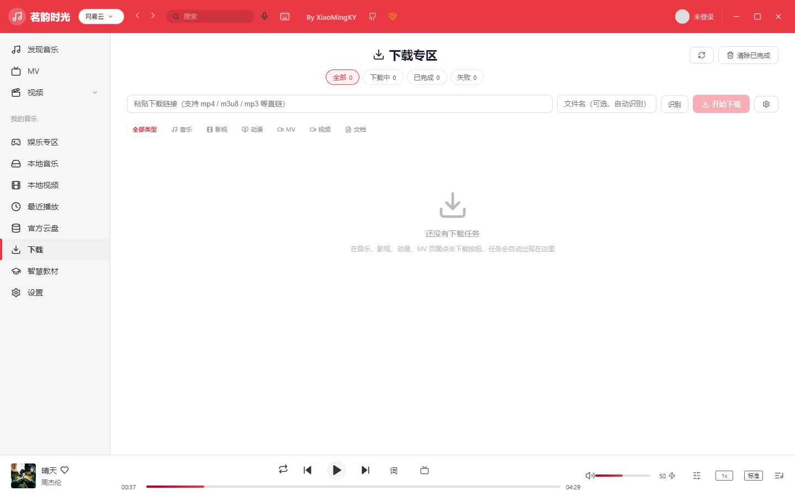

Music, MVs, anime, movies, videos and textbooks share the Downloads sidebar entry.

- **Find tasks**: filter All / Downloading / Completed / Failed, then choose music, movies, anime, MV, video or documents.
- **Manage tasks**: pause, resume, cancel, retry or remove according to state. Clear completed removes records; it does not mean deleting files.
- **Inspect details**: expand a task to see URL, path, time, progress, speed and errors. Copy its link or open its folder.
- **Custom download**: paste an HTTP / HTTPS direct URL, recognize the filename, rename if needed and start.
- **Gear settings**: choose 8 / 16 / 32 / 64 / 128 threads (default 32), User-Agent, Referer and additional headers. Reduce threads after failures or rate limits; more connections do not guarantee higher speed.
- **Destination**: Settings → Downloads selects a unified folder or restores the system default.
- **Persistence**: records are saved to disk. Resumption depends on the task state and source. Bundled aria2c, ffmpeg and related utilities support applicable segment and audio/video merging.

## Settings and smaller conveniences

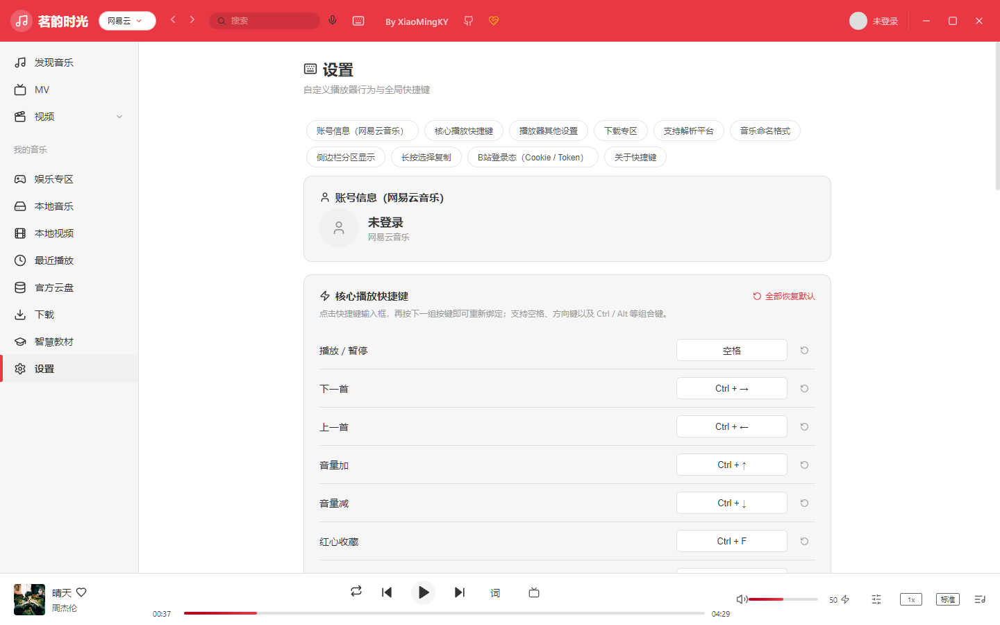

Sticky navigation at the top jumps to settings sections. Account options vary by platform and login state.

| Feature | Where and how to use it |
| --- | --- |
| Account information | Inspect avatar, name, statistics and membership; QQ / KuGou show supported credential and copy controls |
| Custom shortcuts | Click the recording area and press a new combination; Esc cancels; reset one or all bindings |
| Window close behavior | Ask each time, minimize to tray or quit |
| NetEase API routes | Main / recommended / backup; switching refreshes the app; shown for NetEase |
| Download folder | Choose a destination or restore default |
| Music naming format | Download naming and local recognition order; rescan local music after changing |
| Sidebar visibility | Hide / restore sections; Settings remains available |
| Long-press text selection | Toggle text selection; input fields remain usable when selection is disabled |
| Bilibili login state | Inspect, copy or paste Web Cookie and TV Token separately; keep credentials private |
| Virtual keyboard | Use the top keyboard icon to open the system keyboard |
| Microphone icon | Currently decorative; use the top input field to search |
| Back / forward | Use the top arrows to navigate browsing history |
| Tray | Right-click for previous / next, play / pause, show window and quit |
| GitHub / donation | Top icons open the repository and donation panel respectively |
| Update prompt | View release notes, download or defer |

## Keyboard shortcuts

These defaults work **inside the application window**. Text fields and shortcut recording avoid conflicts. They are not system-wide hotkeys that apply in every program.

| Action | Default |
| --- | --- |
| Play / pause | Space |
| Next / previous track | Ctrl + Right / Ctrl + Left |
| Volume up / down | Ctrl + Up / Ctrl + Down |
| Heart | Ctrl + F |
| Change playback mode | Ctrl + T |

Media-session handling provides system media keys, with background availability depending on the device and OS. Esc closes menus; clicking lyrics seeks to the line.

## Troubleshooting

| Symptom | What to try |
| --- | --- |
| Empty home page | Wait for services and refresh; change NetEase route; check network for other sources |
| Playback failure / quality fallback | Sign in, check membership / region / rights and try lower quality |
| Wrong lyrics / no translation / no word timing | Select another lyric source; styles cannot create missing data |
| Slow animation on Win7 / older computers | Enable performance mode, 30 FPS and nearby lyrics; disable spectrum and cover motion |
| Download 403 / 429 | Reduce threads; check login, expired URLs and request headers before retrying |
| Restricted Bilibili quality | Check the selected interface, matching Web / TV login and membership |
| Video plays audio only | Check the actual codec; HEVC depends on system decoding, so try another encoding |
| Missing sidebar section | Restore its visibility in Settings |
| Music continues after closing | Check tray mode; quit through the tray or select direct exit |

When reporting an issue, include the app version, Windows version, platform, reproduction steps and public screenshots. Do not include Cookies, Tokens or API keys.

## Development and build

Installed releases require no development environment. For development, Node.js 22 LTS and npm are recommended. The base frontend requires Node.js 18+, while some current dependencies / API tools require newer versions. Build Windows packages on Windows.

```bash
npm install
npm run dev
```

Use `npm run dev:light` on memory-constrained machines. For a full build:

```bash
npm run build
```

The script prepares three music API services, runs Vite and electron-builder, and writes x64 NSIS / 7z packages to `release/`. `npm run preview` previews the built frontend only. Features relying on Electron IPC, including QQ, esports and downloads, are not fully available in a regular browser.

| Component | Technology / location |
| --- | --- |
| UI | Vue 3, Pinia, Vue Router, Lucide; src/views/, src/components/ |
| Playback | HTML Audio / Web Audio; src/store/player.js |
| Apple-style lyrics | Apple Music-like Lyrics and adapter; src/utils/apple-lyric-player.js |
| Desktop / IPC | Electron 22; electron/ |
| Video | Artplayer, hls.js, mpegts.js / flv.js |
| Metadata | music-metadata, node-id3 |
| Downloads / APIs | aria2c, ffmpeg, yt-dlp, three platform services; resources/ |
| Build | Vite 5, vite-plugin-electron, electron-builder; build/, scripts/ |
| Showcase media | showimage/v3.6.1/ |

Electron normally starts NetEase on port 3100, QQ on 3200 and KuGou on 3300. NetEase / KuGou include online fallback; QQ is accessed through IPC. For self-hosted routes, inspect `src/api/index.js`, `src/api/qq.js`, `src/api/kugou.js` and the main-process service modules.

Self-hosted cloud music / account locks use `VITE_CLOUD_BASE_URL`, with the backend and website deployed separately. AI keys are configured in the interface and stored locally; analyzed lyrics are sent to the selected AI service.

## Credits and support

| Project | Used for |
| --- | --- |
| [NeteaseCloudMusicApiEnhanced](https://github.com/NeteaseCloudMusicApiEnhanced/api-enhanced) | NetEase |
| [KuGouMusicApi](https://github.com/MakcRe/KuGouMusicApi) | KuGou |
| [qq-music-api](https://github.com/sansenjian/qq-music-api) | QQ |
| [Apple Music-like Lyrics](https://github.com/Steve-xmh/applemusic-like-lyrics) | Lyrics |
| [Vue](https://vuejs.org/) / [Electron](https://www.electronjs.org/) / [Artplayer](https://github.com/zhw2590582/ArtPlayer) | Application frameworks |
| [Bangumi](https://bangumi.tv/) and esports sources | Title / event information |

The project declares **MIT** licensing. Third-party APIs, data, media and tools retain their respective rights and licenses; use content you are entitled to access.

[Issues](https://github.com/xiaomingky/MingYunTime/issues) and focused Pull Requests are welcome. Give the project a Star on [GitHub](https://github.com/xiaomingky/MingYunTime), or use the app's donation entry to support development.

[](https://dartnode.com)

<details>
<summary>Donation support</summary>


</details>

Author website: [xiaomingky.dpdns.org](https://xiaomingky.dpdns.org) · App website: [music.xiaomingky.dpdns.org](https://music.xiaomingky.dpdns.org) · [Releases](https://github.com/xiaomingky/MingYunTime/releases) · [中文版](README.md)
